# ToyShop Backend - Architecture Documentation

> Microservices-based e-commerce platform built with Spring Boot, Spring Cloud, and event-driven architecture.

---

## Table of Contents

1. [System Overview](#system-overview)
2. [High-Level Design (HLD)](#high-level-design)
3. [Architecture Diagram](#architecture-diagram)
4. [Service Interaction Flow](#service-interaction-flow)
5. [Data Architecture](#data-architecture)
6. [Event-Driven Architecture](#event-driven-architecture)
7. [Security Architecture](#security-architecture)
8. [Infrastructure Diagram (Local)](#infrastructure-diagram-local)
9. [Infrastructure Diagram (Cloud / Production)](#infrastructure-diagram-cloud--production)
10. [Deployment Architecture (Kubernetes)](#deployment-architecture-kubernetes)
11. [Technology Stack](#technology-stack)
12. [Frontend Architecture](#frontend-architecture)
13. [API Contract Diagram](#api-contract-diagram)
14. [Domain Model](#domain-model)
15. [Order State Machine](#order-state-machine)
16. [CI/CD Pipeline](#cicd-pipeline)
17. [Network Topology](#network-topology)
18. [Observability Stack](#observability-stack)
19. [Resilience Patterns](#resilience-patterns)
20. [Data Flow - Product Purchase](#data-flow---product-purchase)

---

## System Overview

ToyShop is a cloud-native e-commerce backend built as a suite of independently deployable microservices. Each service owns its domain, its database, and communicates either synchronously via REST (through the API Gateway) or asynchronously via Kafka events.

```
Client (React SPA)
      │
      ▼
API Gateway  ──►  Service Discovery (Eureka)
      │
      ├──► User Service      (auth, JWT, profiles)
      ├──► Product Service   (catalog, inventory, images)
      ├──► Order Service     (cart, orders, fulfillment)
      └──► Payment Service   (transactions, refunds)
                                    │
                              Kafka Events
                                    │
                             Notification Service
                             (email, push alerts)
```

---

## High-Level Design

### HLD - Component View

> **Actual MS-to-MS connectivity:** There is NO direct HTTP calls between services. All client traffic routes through the API Gateway. Inter-service communication is **async only via Kafka** (User/Order/Payment → Notification).

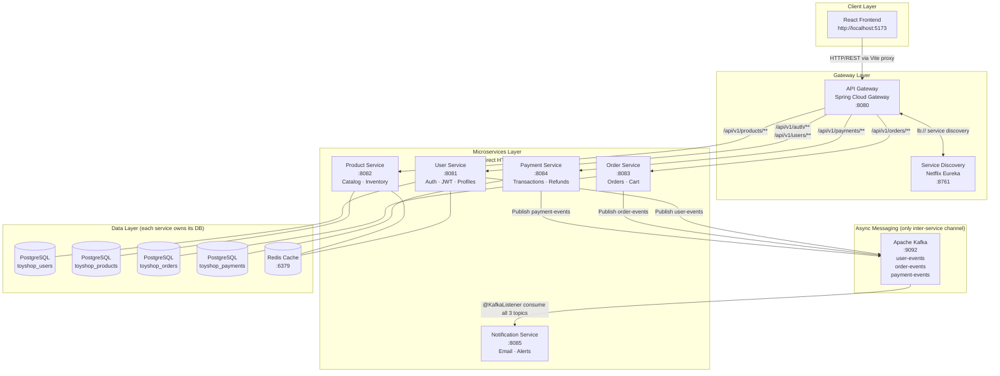
```mermaid
graph TB
    subgraph Client["Client Layer"]
        FE["React Frontend\nhttp://localhost:5173"]
    end

    subgraph Gateway["Gateway Layer"]
        GW["API Gateway\nSpring Cloud Gateway\n:8080"]
        SD["Service Discovery\nNetflix Eureka\n:8761"]
    end

    subgraph Services["Microservices Layer\n(no direct HTTP between services)"]
        US["User Service\n:8081\nAuth · JWT · Profiles"]
        PS["Product Service\n:8082\nCatalog · Inventory"]
        OS["Order Service\n:8083\nOrders · Cart"]
        PMS["Payment Service\n:8084\nTransactions · Refunds"]
        NS["Notification Service\n:8085\nEmail · Alerts"]
    end

    subgraph Messaging["Async Messaging (only inter-service channel)"]
        KF["Apache Kafka\n:9092\nuser-events\norder-events\npayment-events"]
    end

    subgraph Storage["Data Layer (each service owns its DB)"]
        PG1[("PostgreSQL\ntoyshop_users")]
        PG2[("PostgreSQL\ntoyshop_products")]
        PG3[("PostgreSQL\ntoyshop_orders")]
        PG4[("PostgreSQL\ntoyshop_payments")]
        RD[("Redis Cache\n:6379")]
    end

    FE -->|"HTTP/REST via Vite proxy"| GW
    GW <-->|"lb:// service discovery"| SD
    GW -->|"/api/v1/auth/**\n/api/v1/users/**"| US
    GW -->|"/api/v1/products/**"| PS
    GW -->|"/api/v1/orders/**"| OS
    GW -->|"/api/v1/payments/**"| PMS

    US -->|"Publish user-events"| KF
    OS -->|"Publish order-events"| KF
    PMS -->|"Publish payment-events"| KF
    KF -->|"@KafkaListener consume all 3 topics"| NS

    US --- PG1
    PS --- PG2
    OS --- PG3
    PMS --- PG4
    US --- RD
    PS --- RD
```

---

## Architecture Diagram

### Detailed Service Architecture

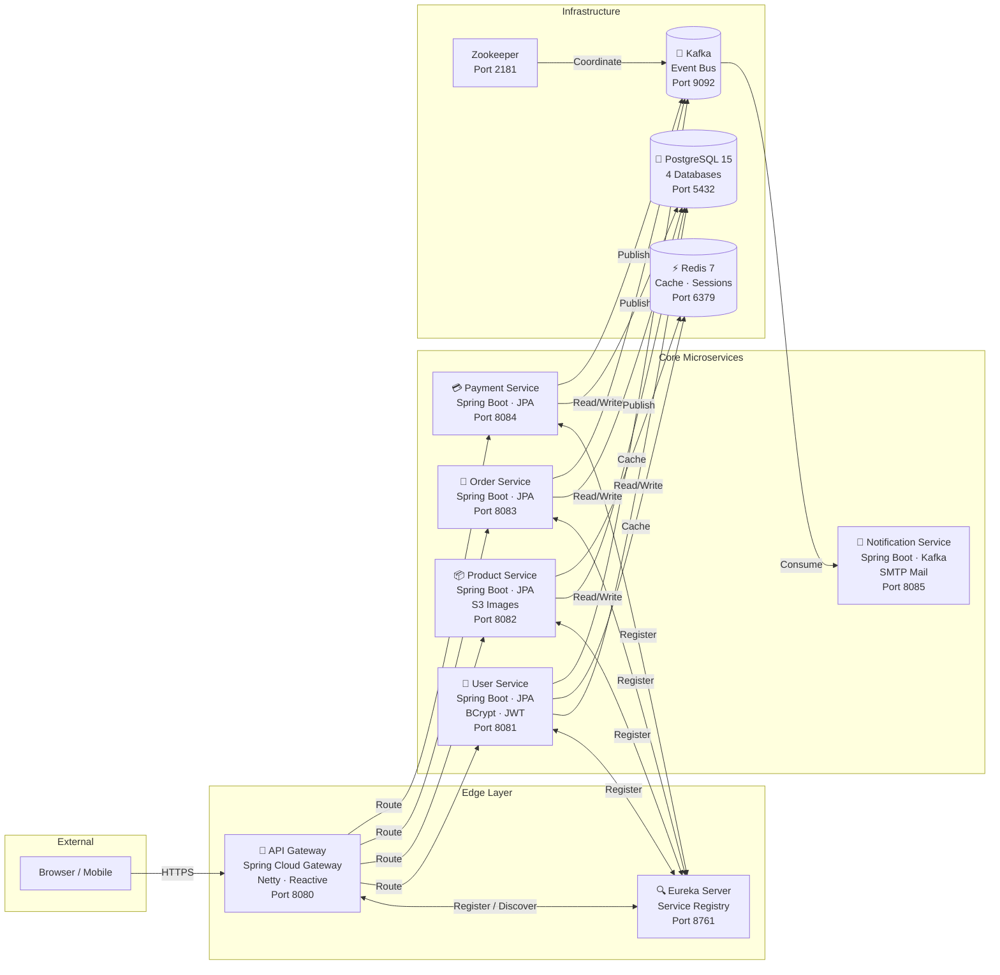
```mermaid
graph LR
    subgraph External["External"]
        Browser["Browser / Mobile"]
    end

    subgraph EdgeLayer["Edge Layer"]
        GW["🔀 API Gateway\nSpring Cloud Gateway\nNetty · Reactive\nPort 8080"]
        SD["🔍 Eureka Server\nService Registry\nPort 8761"]
    end

    subgraph CoreServices["Core Microservices"]
        direction TB
        US["👤 User Service\nSpring Boot · JPA\nBCrypt · JWT\nPort 8081"]
        PS["📦 Product Service\nSpring Boot · JPA\nS3 Images\nPort 8082"]
        OS["🛒 Order Service\nSpring Boot · JPA\nPort 8083"]
        PMS["💳 Payment Service\nSpring Boot · JPA\nPort 8084"]
        NS["🔔 Notification Service\nSpring Boot · Kafka\nSMTP Mail\nPort 8085"]
    end

    subgraph Infra["Infrastructure"]
        direction TB
        PG[("🐘 PostgreSQL 15\n4 Databases\nPort 5432")]
        RD[("⚡ Redis 7\nCache · Sessions\nPort 6379")]
        KF[("📨 Kafka\nEvent Bus\nPort 9092")]
        ZK["Zookeeper\nPort 2181"]
    end

    Browser -->|HTTPS| GW
    GW <-->|"Register / Discover"| SD
    US <-->|"Register"| SD
    PS <-->|"Register"| SD
    OS <-->|"Register"| SD
    PMS <-->|"Register"| SD

    GW -->|"Route"| US
    GW -->|"Route"| PS
    GW -->|"Route"| OS
    GW -->|"Route"| PMS

    US -->|"Read/Write"| PG
    PS -->|"Read/Write"| PG
    OS -->|"Read/Write"| PG
    PMS -->|"Read/Write"| PG

    US -->|"Cache"| RD
    PS -->|"Cache"| RD

    US -->|"Publish"| KF
    OS -->|"Publish"| KF
    PMS -->|"Publish"| KF
    KF -->|"Consume"| NS
    ZK -->|"Coordinate"| KF
```

---

## Service Interaction Flow

### User Login Flow

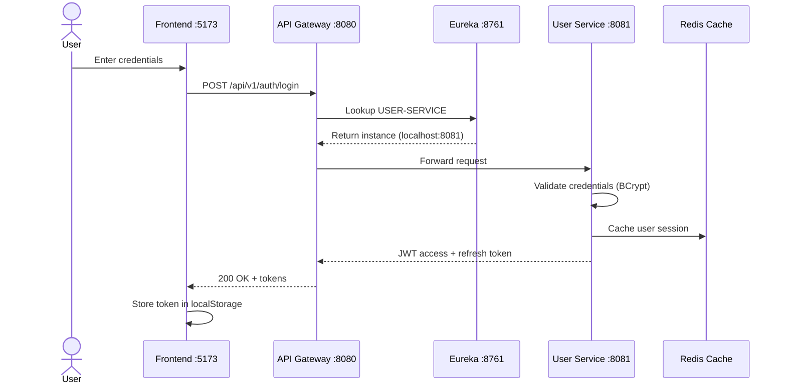
```mermaid
sequenceDiagram
    actor User
    participant FE as Frontend :5173
    participant GW as API Gateway :8080
    participant SD as Eureka :8761
    participant US as User Service :8081
    participant RD as Redis Cache

    User->>FE: Enter credentials
    FE->>GW: POST /api/v1/auth/login
    GW->>SD: Lookup USER-SERVICE
    SD-->>GW: Return instance (localhost:8081)
    GW->>US: Forward request
    US->>US: Validate credentials (BCrypt)
    US->>RD: Cache user session
    US-->>GW: JWT access + refresh token
    GW-->>FE: 200 OK + tokens
    FE->>FE: Store token in localStorage
```

### Place Order Flow

> **Note:** Order Service does NOT call Product Service directly. Product details (name, SKU, price) are passed by the frontend in the request body. The only inter-service communication is async via Kafka.

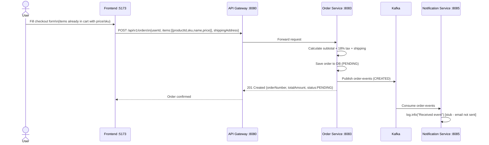
```mermaid
sequenceDiagram
    actor User
    participant FE as Frontend :5173
    participant GW as API Gateway :8080
    participant OS as Order Service :8083
    participant KF as Kafka
    participant NS as Notification Service :8085

    User->>FE: Fill checkout form\n(items already in cart with price/sku)
    FE->>GW: POST /api/v1/orders\n{userId, items:[{productId,sku,name,price}], shippingAddress}
    GW->>OS: Forward request
    OS->>OS: Calculate subtotal + 18% tax + shipping
    OS->>OS: Save order to DB (PENDING)
    OS->>KF: Publish order-events (CREATED)
    OS-->>GW: 201 Created {orderNumber, totalAmount, status:PENDING}
    GW-->>FE: Order confirmed
    KF->>NS: Consume order-events
    NS->>NS: log.info("Received event") [stub - email not sent]
```

---

## Data Architecture

### Database-per-Service Pattern

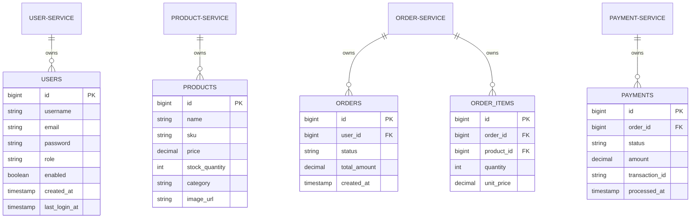
```mermaid
erDiagram
    USER-SERVICE ||--o{ USERS : owns
    USERS {
        bigint id PK
        string username
        string email
        string password
        string role
        boolean enabled
        timestamp created_at
        timestamp last_login_at
    }

    PRODUCT-SERVICE ||--o{ PRODUCTS : owns
    PRODUCTS {
        bigint id PK
        string name
        string sku
        decimal price
        int stock_quantity
        string category
        string image_url
    }

    ORDER-SERVICE ||--o{ ORDERS : owns
    ORDERS {
        bigint id PK
        bigint user_id FK
        string status
        decimal total_amount
        timestamp created_at
    }

    ORDER-SERVICE ||--o{ ORDER_ITEMS : owns
    ORDER_ITEMS {
        bigint id PK
        bigint order_id FK
        bigint product_id FK
        int quantity
        decimal unit_price
    }

    PAYMENT-SERVICE ||--o{ PAYMENTS : owns
    PAYMENTS {
        bigint id PK
        bigint order_id FK
        string status
        decimal amount
        string transaction_id
        timestamp processed_at
    }
```

### Caching Strategy

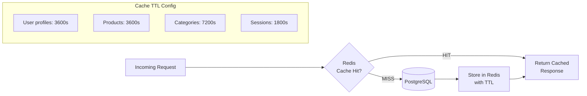
```mermaid
flowchart LR
    REQ["Incoming Request"] --> CACHE{"Redis\nCache Hit?"}
    CACHE -->|"HIT"| RESP["Return Cached\nResponse"]
    CACHE -->|"MISS"| DB[("PostgreSQL")]
    DB --> STORE["Store in Redis\nwith TTL"]
    STORE --> RESP

    subgraph TTLs["Cache TTL Config"]
        U["User profiles: 3600s"]
        P["Products: 3600s"]
        C["Categories: 7200s"]
        S["Sessions: 1800s"]
    end
```

---

## Event-Driven Architecture

### Kafka Topics & Consumers

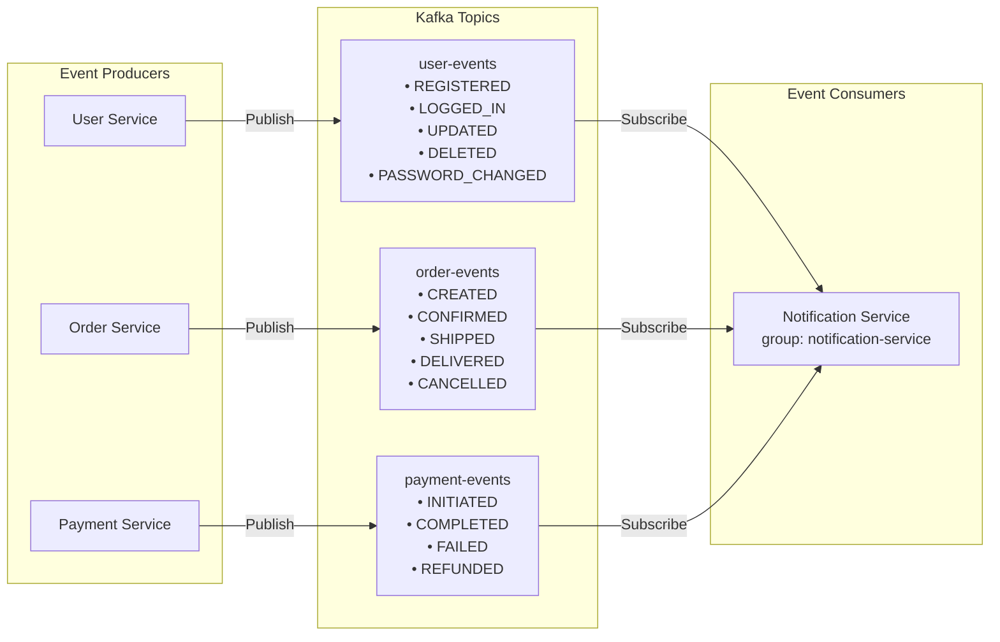
```mermaid
flowchart LR
    subgraph Producers["Event Producers"]
        US["User Service"]
        OS["Order Service"]
        PMS["Payment Service"]
    end

    subgraph Topics["Kafka Topics"]
        T1["user-events\n• REGISTERED\n• LOGGED_IN\n• UPDATED\n• DELETED\n• PASSWORD_CHANGED"]
        T2["order-events\n• CREATED\n• CONFIRMED\n• SHIPPED\n• DELIVERED\n• CANCELLED"]
        T3["payment-events\n• INITIATED\n• COMPLETED\n• FAILED\n• REFUNDED"]
    end

    subgraph Consumers["Event Consumers"]
        NS["Notification Service\ngroup: notification-service"]
    end

    US -->|"Publish"| T1
    OS -->|"Publish"| T2
    PMS -->|"Publish"| T3

    T1 -->|"Subscribe"| NS
    T2 -->|"Subscribe"| NS
    T3 -->|"Subscribe"| NS
```

---

## Security Architecture

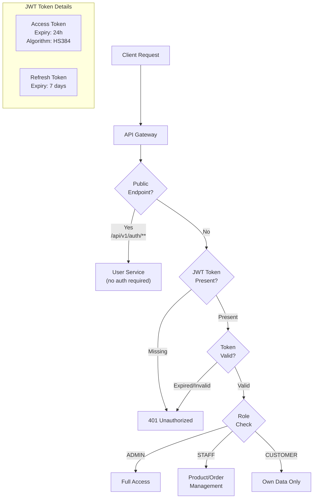
```mermaid
flowchart TD
    CLIENT["Client Request"] --> GW["API Gateway"]

    GW --> PUBLIC{"Public\nEndpoint?"}
    PUBLIC -->|"Yes\n/api/v1/auth/**"| US["User Service\n(no auth required)"]
    PUBLIC -->|"No"| JWT{"JWT Token\nPresent?"}

    JWT -->|"Missing"| R401["401 Unauthorized"]
    JWT -->|"Present"| VALID{"Token\nValid?"}

    VALID -->|"Expired/Invalid"| R401
    VALID -->|"Valid"| ROLE{"Role\nCheck"}

    ROLE -->|"ADMIN"| ALL["Full Access"]
    ROLE -->|"STAFF"| LIMITED["Product/Order\nManagement"]
    ROLE -->|"CUSTOMER"| OWN["Own Data Only"]

    subgraph TokenFlow["JWT Token Details"]
        AT["Access Token\nExpiry: 24h\nAlgorithm: HS384"]
        RT["Refresh Token\nExpiry: 7 days"]
    end
```

---

## Infrastructure Diagram (Local)

### Local Development Stack

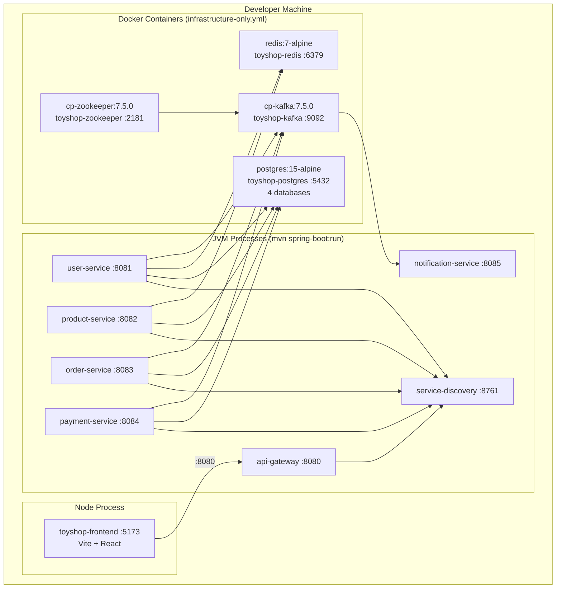
```mermaid
graph TB
    subgraph Host["Developer Machine"]
        subgraph JVM["JVM Processes (mvn spring-boot:run)"]
            SD["service-discovery :8761"]
            GW["api-gateway :8080"]
            US["user-service :8081"]
            PS["product-service :8082"]
            OS["order-service :8083"]
            PMS["payment-service :8084"]
            NS["notification-service :8085"]
        end

        subgraph Node["Node Process"]
            FE["toyshop-frontend :5173\nVite + React"]
        end

        subgraph Docker["Docker Containers (infrastructure-only.yml)"]
            PG["postgres:15-alpine\ntoyshop-postgres :5432\n4 databases"]
            RD["redis:7-alpine\ntoyshop-redis :6379"]
            KF["cp-kafka:7.5.0\ntoyshop-kafka :9092"]
            ZK["cp-zookeeper:7.5.0\ntoyshop-zookeeper :2181"]
        end
    end

    GW --> SD
    US --> SD
    PS --> SD
    OS --> SD
    PMS --> SD

    US --> PG
    PS --> PG
    OS --> PG
    PMS --> PG
    US --> RD
    PS --> RD
    US --> KF
    OS --> KF
    PMS --> KF
    KF --> NS
    ZK --> KF

    FE -->|":8080"| GW
```

---

## Infrastructure Diagram (Cloud / Production)

### AWS Production Architecture

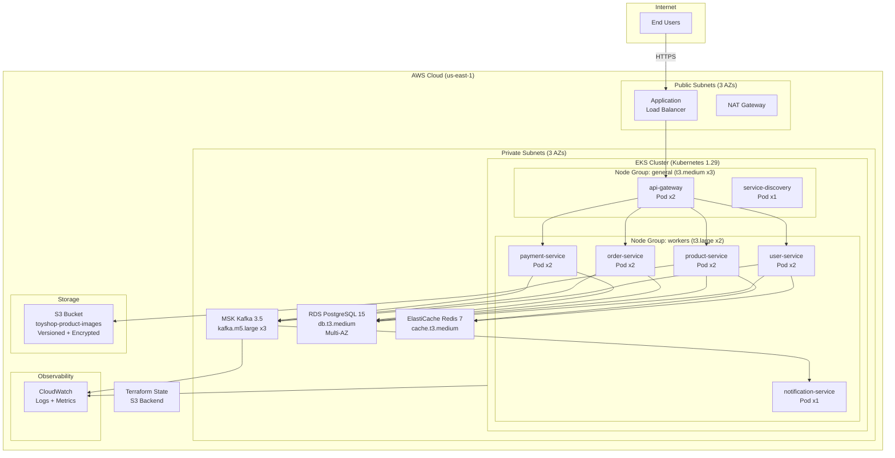
```mermaid
graph TB
    subgraph Internet["Internet"]
        USERS["End Users"]
    end

    subgraph AWS["AWS Cloud (us-east-1)"]
        subgraph PublicSubnets["Public Subnets (3 AZs)"]
            ALB["Application\nLoad Balancer"]
            NAT["NAT Gateway"]
        end

        subgraph PrivateSubnets["Private Subnets (3 AZs)"]
            subgraph EKS["EKS Cluster (Kubernetes 1.29)"]
                subgraph GeneralNG["Node Group: general (t3.medium x3)"]
                    GW_K["api-gateway\nPod x2"]
                    SD_K["service-discovery\nPod x1"]
                end
                subgraph WorkerNG["Node Group: workers (t3.large x2)"]
                    US_K["user-service\nPod x2"]
                    PS_K["product-service\nPod x2"]
                    OS_K["order-service\nPod x2"]
                    PMS_K["payment-service\nPod x2"]
                    NS_K["notification-service\nPod x1"]
                end
            end

            RDS["RDS PostgreSQL 15\ndb.t3.medium\nMulti-AZ"]
            REDIS["ElastiCache Redis 7\ncache.t3.medium"]
            MSK["MSK Kafka 3.5\nkafka.m5.large x3"]
        end

        subgraph Storage["Storage"]
            S3["S3 Bucket\ntoyshop-product-images\nVersioned + Encrypted"]
        end

        subgraph Observability["Observability"]
            CW["CloudWatch\nLogs + Metrics"]
        end

        TF["Terraform State\nS3 Backend"]
    end

    USERS -->|"HTTPS"| ALB
    ALB --> GW_K
    GW_K --> US_K
    GW_K --> PS_K
    GW_K --> OS_K
    GW_K --> PMS_K
    US_K --> RDS
    PS_K --> RDS
    OS_K --> RDS
    PMS_K --> RDS
    US_K --> REDIS
    PS_K --> REDIS
    PS_K --> S3
    US_K --> MSK
    OS_K --> MSK
    PMS_K --> MSK
    MSK --> NS_K
    EKS --> CW
    MSK --> CW
```

---

## Deployment Architecture (Kubernetes)

### K8s Resource Layout

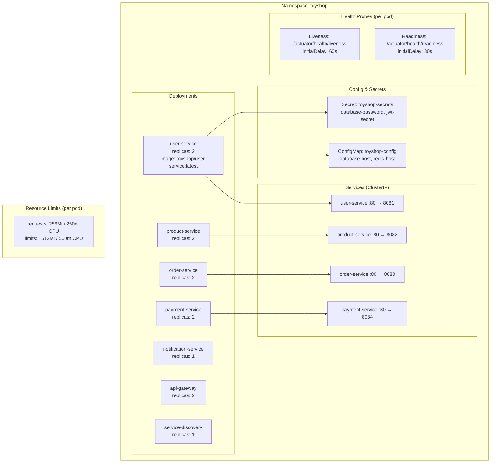
```mermaid
graph TB
    subgraph NS_TOY["Namespace: toyshop"]
        subgraph Deployments["Deployments"]
            D1["user-service\nreplicas: 2\nimage: toyshop/user-service:latest"]
            D2["product-service\nreplicas: 2"]
            D3["order-service\nreplicas: 2"]
            D4["payment-service\nreplicas: 2"]
            D5["notification-service\nreplicas: 1"]
            D6["api-gateway\nreplicas: 2"]
            D7["service-discovery\nreplicas: 1"]
        end

        subgraph Services_K8s["Services (ClusterIP)"]
            SVC1["user-service :80 → 8081"]
            SVC2["product-service :80 → 8082"]
            SVC3["order-service :80 → 8083"]
            SVC4["payment-service :80 → 8084"]
        end

        subgraph Config["Config & Secrets"]
            CM["ConfigMap: toyshop-config\ndatabase-host, redis-host"]
            SEC["Secret: toyshop-secrets\ndatabase-password, jwt-secret"]
        end

        subgraph Probes["Health Probes (per pod)"]
            LP["Liveness: /actuator/health/liveness\ninitialDelay: 60s"]
            RP["Readiness: /actuator/health/readiness\ninitialDelay: 30s"]
        end
    end

    subgraph Resources["Resource Limits (per pod)"]
        RES["requests: 256Mi / 250m CPU\nlimits:   512Mi / 500m CPU"]
    end

    D1 --> SVC1
    D2 --> SVC2
    D3 --> SVC3
    D4 --> SVC4
    D1 --> CM
    D1 --> SEC
```

---

## Technology Stack

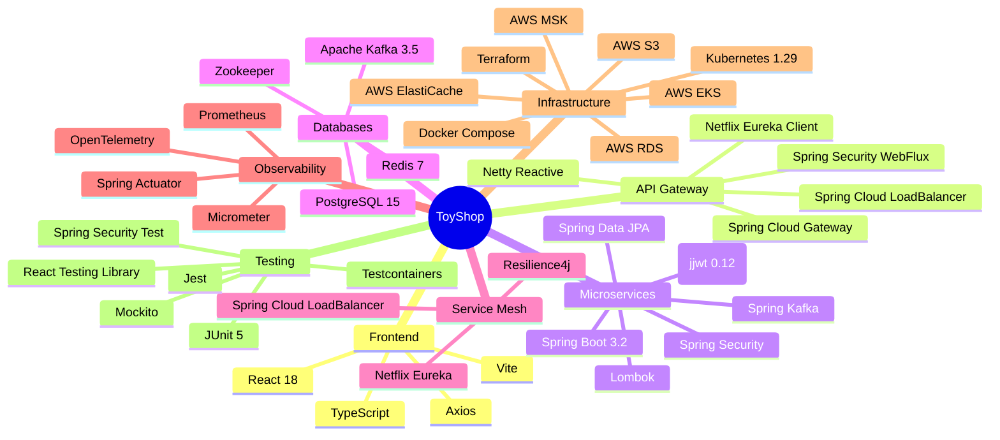
```mermaid
mindmap
  root((ToyShop))
    Frontend
      React 18
      Vite
      TypeScript
      Axios
    API Gateway
      Spring Cloud Gateway
      Netty Reactive
      Spring Security WebFlux
      Netflix Eureka Client
      Spring Cloud LoadBalancer
    Microservices
      Spring Boot 3.2
      Spring Data JPA
      Spring Security
      Spring Kafka
      Lombok
      JWT (jjwt 0.12)
    Databases
      PostgreSQL 15
      Redis 7
      Apache Kafka 3.5
      Zookeeper
    Service Mesh
      Netflix Eureka
      Spring Cloud LoadBalancer
      Resilience4j
    Observability
      Spring Actuator
      Micrometer
      Prometheus
      OpenTelemetry
    Infrastructure
      Docker Compose
      Kubernetes 1.29
      Terraform
      AWS EKS
      AWS RDS
      AWS ElastiCache
      AWS MSK
      AWS S3
    Testing
      JUnit 5
      Mockito
      Testcontainers
      Spring Security Test
      Jest
      React Testing Library
```

---

## Port Reference

| Service | Port | Protocol | Notes |
|---------|------|----------|-------|
| API Gateway | 8080 | HTTP/Reactive | Main entry point for all clients |
| User Service | 8081 | HTTP/Servlet | Auth, JWT issuance |
| Product Service | 8082 | HTTP/Servlet | Catalog, S3 image upload |
| Order Service | 8083 | HTTP/Servlet | Order lifecycle |
| Payment Service | 8084 | HTTP/Servlet | Transactions |
| Notification Service | 8085 | HTTP/Servlet | Email via SMTP |
| Eureka Dashboard | 8761 | HTTP | Service registry UI |
| PostgreSQL | 5432 | TCP | 4 separate databases |
| Redis | 6379 | TCP | Cache + sessions |
| Kafka | 9092 | TCP | Event streaming |
| Zookeeper | 2181 | TCP | Kafka coordination |
| Frontend (dev) | 5173 | HTTP | Vite dev server |

---

## Frontend Architecture

### React Application Structure

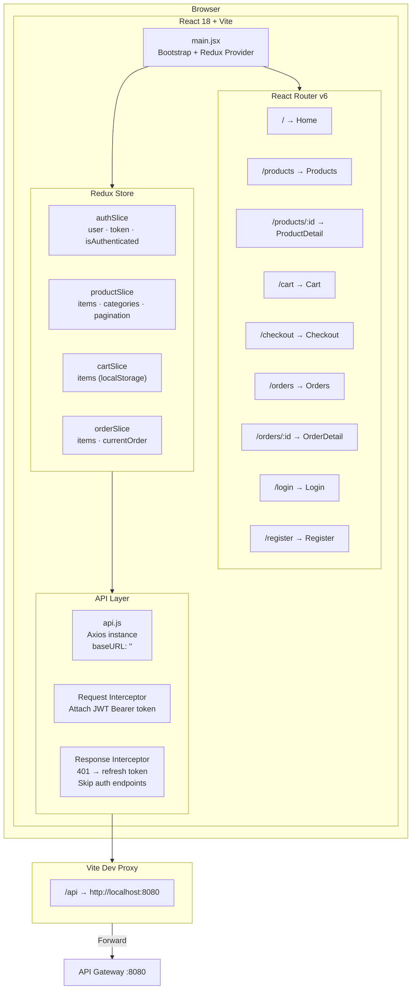
```mermaid
graph TD
    subgraph Browser["Browser"]
        subgraph ReactApp["React 18 + Vite"]
            MAIN["main.jsx\nBootstrap + Redux Provider"]

            subgraph Routing["React Router v6"]
                R1["/ → Home"]
                R2["/products → Products"]
                R3["/products/:id → ProductDetail"]
                R4["/cart → Cart"]
                R5["/checkout → Checkout"]
                R6["/orders → Orders"]
                R7["/orders/:id → OrderDetail"]
                R8["/login → Login"]
                R9["/register → Register"]
            end

            subgraph Store["Redux Store"]
                SA["authSlice\nuser · token · isAuthenticated"]
                SP["productSlice\nitems · categories · pagination"]
                SC["cartSlice\nitems (localStorage)"]
                SO["orderSlice\nitems · currentOrder"]
            end

            subgraph Services["API Layer"]
                API["api.js\nAxios instance\nbaseURL: ''"]
                INT1["Request Interceptor\nAttach JWT Bearer token"]
                INT2["Response Interceptor\n401 → refresh token\nSkip auth endpoints"]
            end
        end
    end

    subgraph Proxy["Vite Dev Proxy"]
        PROXY["/api → http://localhost:8080"]
    end

    MAIN --> Routing
    MAIN --> Store
    Store --> Services
    Services --> Proxy
    Proxy -->|"Forward"| GW["API Gateway :8080"]
```

---

## API Contract Diagram

### REST Endpoints by Service

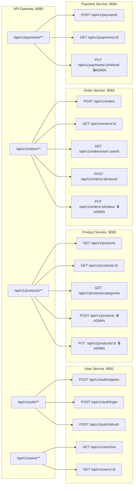
```mermaid
graph LR
    subgraph GW["API Gateway :8080"]
        direction TB
        AUTH_R["/api/v1/auth/**"]
        USER_R["/api/v1/users/**"]
        PROD_R["/api/v1/products/**"]
        ORD_R["/api/v1/orders/**"]
        PAY_R["/api/v1/payments/**"]
    end

    subgraph US["User Service :8081"]
        direction TB
        U1["POST /api/v1/auth/register"]
        U2["POST /api/v1/auth/login"]
        U3["POST /api/v1/auth/refresh"]
        U4["GET  /api/v1/users/me"]
        U5["GET  /api/v1/users/:id"]
    end

    subgraph PS["Product Service :8082"]
        direction TB
        P1["GET  /api/v1/products"]
        P2["GET  /api/v1/products/:id"]
        P3["GET  /api/v1/products/categories"]
        P4["POST /api/v1/products  🔒ADMIN"]
        P5["PUT  /api/v1/products/:id  🔒ADMIN"]
    end

    subgraph OS["Order Service :8083"]
        direction TB
        O1["POST /api/v1/orders"]
        O2["GET  /api/v1/orders/:id"]
        O3["GET  /api/v1/orders/user/:userId"]
        O4["POST /api/v1/orders/:id/cancel"]
        O5["PUT  /api/v1/orders/:id/status  🔒ADMIN"]
    end

    subgraph PMS["Payment Service :8084"]
        direction TB
        PM1["POST /api/v1/payments"]
        PM2["GET  /api/v1/payments/:id"]
        PM3["PUT  /api/v1/payments/:id/refund  🔒ADMIN"]
    end

    AUTH_R --> U1 & U2 & U3
    USER_R --> U4 & U5
    PROD_R --> P1 & P2 & P3 & P4 & P5
    ORD_R  --> O1 & O2 & O3 & O4 & O5
    PAY_R  --> PM1 & PM2 & PM3
```

---

## Domain Model

### Bounded Contexts & Aggregates

```mermaid
graph TB
    subgraph UserDomain["User Domain"]
        USER["User\n─────────\nid: Long\nusername: String\nemail: String\npassword: BCrypt\nrole: ADMIN|STAFF|CUSTOMER\nenabled: boolean"]
    end

    subgraph ProductDomain["Product Domain"]
        PRODUCT["Product\n─────────\nid: UUID\nsku: String\nname: String\nprice: BigDecimal\nstockQuantity: int\ncategory: String\nbrand: String\nstatus: ACTIVE|INACTIVE\nfeatured: boolean"]
    end

    subgraph OrderDomain["Order Domain"]
        ORDER["Order\n─────────\nid: Long\norderNumber: String\nuserId: Long\nstatus: PENDING→DELIVERED\npaymentStatus: PENDING|COMPLETED\ntotalAmount: BigDecimal"]
        ORDERITEM["OrderItem\n─────────\nproductId: String\nproductSku: String\nquantity: int\nunitPrice: BigDecimal\ntotalPrice: BigDecimal"]
        ORDER ||--o{ ORDERITEM : contains
    end

    subgraph PaymentDomain["Payment Domain"]
        PAYMENT["Payment\n─────────\nid: Long\norderId: Long\namount: BigDecimal\nmethod: COD|UPI|CARD\nstatus: PENDING|COMPLETED|FAILED\ntransactionId: String"]
    end

    ORDER ..->|"userId ref"| USER
    ORDER ..->|"productId ref"| PRODUCT
    PAYMENT ..->|"orderId ref"| ORDER
```

---

## Order State Machine

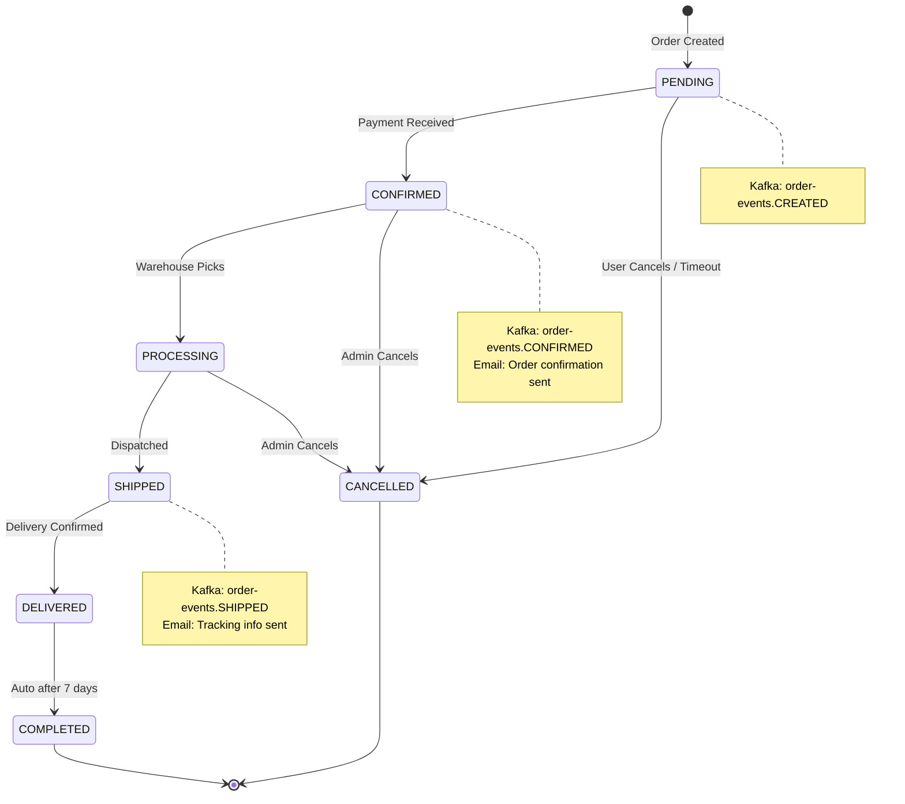
```mermaid
stateDiagram-v2
    [*] --> PENDING : Order Created
    PENDING --> CONFIRMED : Payment Received
    PENDING --> CANCELLED : User Cancels / Timeout
    CONFIRMED --> PROCESSING : Warehouse Picks
    PROCESSING --> SHIPPED : Dispatched
    SHIPPED --> DELIVERED : Delivery Confirmed
    DELIVERED --> COMPLETED : Auto after 7 days
    CONFIRMED --> CANCELLED : Admin Cancels
    PROCESSING --> CANCELLED : Admin Cancels
    COMPLETED --> [*]
    CANCELLED --> [*]

    note right of PENDING
        Kafka: order-events.CREATED
    end note
    note right of CONFIRMED
        Kafka: order-events.CONFIRMED
        Email: Order confirmation sent
    end note
    note right of SHIPPED
        Kafka: order-events.SHIPPED
        Email: Tracking info sent
    end note
```

---

## CI/CD Pipeline

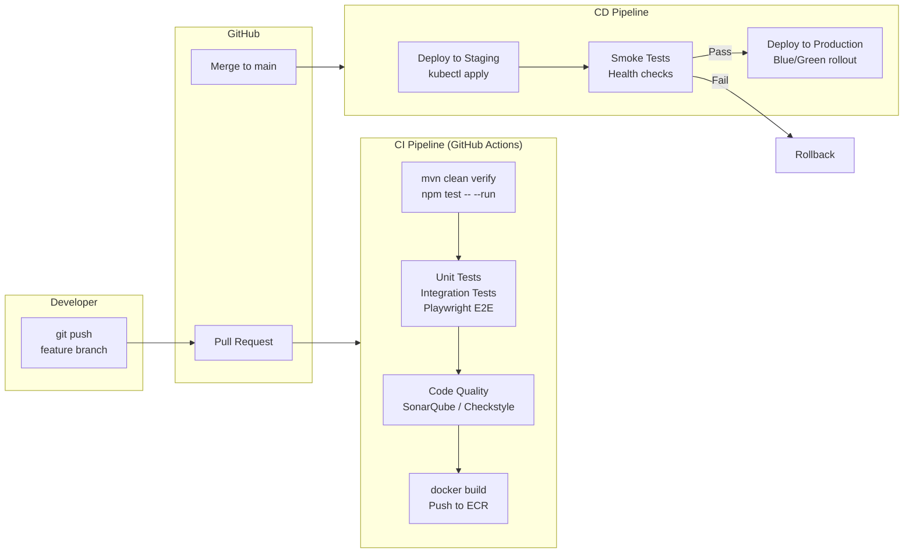
```mermaid
flowchart LR
    subgraph Dev["Developer"]
        CODE["git push\nfeature branch"]
    end

    subgraph GitHub["GitHub"]
        PR["Pull Request"]
        MERGE["Merge to main"]
    end

    subgraph CI["CI Pipeline (GitHub Actions)"]
        direction TB
        BUILD["mvn clean verify\nnpm test -- --run"]
        TEST["Unit Tests\nIntegration Tests\nPlaywright E2E"]
        SCAN["Code Quality\nSonarQube / Checkstyle"]
        DOCKER["docker build\nPush to ECR"]
    end

    subgraph CD["CD Pipeline"]
        direction TB
        STAGING["Deploy to Staging\nkubectl apply"]
        SMOKE["Smoke Tests\nHealth checks"]
        PROD["Deploy to Production\nBlue/Green rollout"]
    end

    CODE --> PR --> CI
    BUILD --> TEST --> SCAN --> DOCKER
    MERGE --> CD
    STAGING --> SMOKE -->|"Pass"| PROD
    SMOKE -->|"Fail"| ROLLBACK["Rollback"]
```

---

## Network Topology

### Request Flow - Detailed

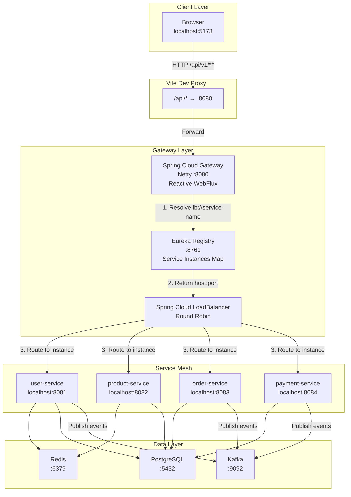
```mermaid
flowchart TD
    subgraph Client["Client Layer"]
        BROWSER["Browser\nlocalhost:5173"]
    end

    subgraph ViteProxy["Vite Dev Proxy\n(Development Only)"]
        PROXY["/api/* → :8080"]
    end

    subgraph GatewayLayer["Gateway Layer"]
        GW["Spring Cloud Gateway\nNetty :8080\nReactive WebFlux"]
        LB["Spring Cloud LoadBalancer\nRound Robin"]
        EUREKA["Eureka Registry\n:8761\nService Instances Map"]
    end

    subgraph ServiceMesh["Service Mesh"]
        US["user-service\nlocalhost:8081"]
        PS["product-service\nlocalhost:8082"]
        OS["order-service\nlocalhost:8083"]
        PMS["payment-service\nlocalhost:8084"]
    end

    subgraph DataLayer["Data Layer"]
        PG["PostgreSQL\n:5432"]
        REDIS["Redis\n:6379"]
        KAFKA["Kafka\n:9092"]
    end

    BROWSER -->|"HTTP /api/v1/**"| PROXY
    PROXY -->|"Forward"| GW
    GW -->|"1. Resolve lb://service-name"| EUREKA
    EUREKA -->|"2. Return host:port"| LB
    LB -->|"3. Route to instance"| US & PS & OS & PMS
    US & PS --> REDIS
    US & PS & OS & PMS --> PG
    US & OS & PMS -->|"Publish events"| KAFKA
```

---

## Observability Stack

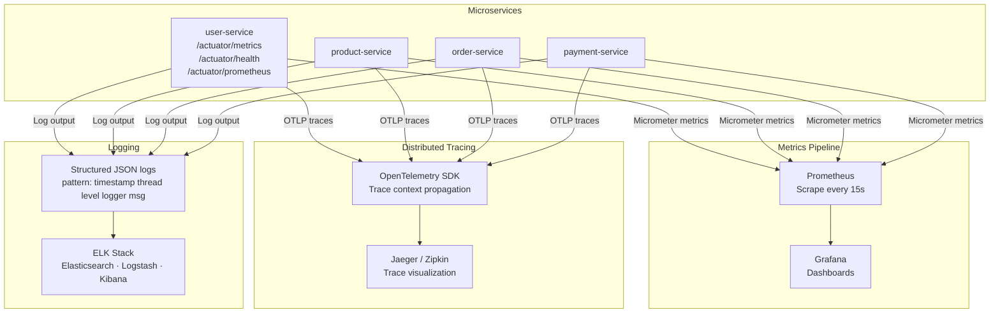
```mermaid
graph TB
    subgraph Services["Microservices"]
        S1["user-service\n/actuator/metrics\n/actuator/health\n/actuator/prometheus"]
        S2["product-service"]
        S3["order-service"]
        S4["payment-service"]
    end

    subgraph Metrics["Metrics Pipeline"]
        PROM["Prometheus\nScrape every 15s"]
        GRAF["Grafana\nDashboards"]
    end

    subgraph Tracing["Distributed Tracing"]
        OTEL["OpenTelemetry SDK\nTrace context propagation"]
        JAEGER["Jaeger / Zipkin\nTrace visualization"]
    end

    subgraph Logging["Logging"]
        LOG["Structured JSON logs\npattern: timestamp thread level logger msg"]
        ELK["ELK Stack\nElasticsearch · Logstash · Kibana"]
    end

    S1 & S2 & S3 & S4 -->|"Micrometer metrics"| PROM
    PROM --> GRAF
    S1 & S2 & S3 & S4 -->|"OTLP traces"| OTEL
    OTEL --> JAEGER
    S1 & S2 & S3 & S4 -->|"Log output"| LOG
    LOG --> ELK
```

---

## Resilience Patterns

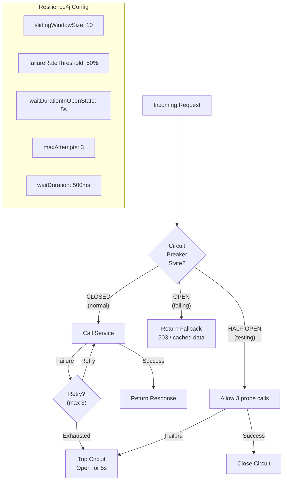
```mermaid
flowchart TD
    REQ["Incoming Request"] --> CB{"Circuit\nBreaker\nState?"}

    CB -->|"CLOSED\n(normal)"| SVC["Call Service"]
    CB -->|"OPEN\n(failing)"| FB["Return Fallback\n503 / cached data"]
    CB -->|"HALF-OPEN\n(testing)"| PROBE["Allow 3 probe calls"]

    SVC -->|"Success"| RESP["Return Response"]
    SVC -->|"Failure"| RETRY{"Retry?\n(max 3)"}
    RETRY -->|"Retry"| SVC
    RETRY -->|"Exhausted"| CB_OPEN["Trip Circuit\nOpen for 5s"]

    PROBE -->|"Success"| CB_CLOSE["Close Circuit"]
    PROBE -->|"Failure"| CB_OPEN

    subgraph Config["Resilience4j Config"]
        C1["slidingWindowSize: 10"]
        C2["failureRateThreshold: 50%"]
        C3["waitDurationInOpenState: 5s"]
        C4["maxAttempts: 3"]
        C5["waitDuration: 500ms"]
    end
```

---

## Data Flow - Product Purchase

### End-to-End Purchase Journey

```mermaid
flowchart LR
    subgraph FE["Frontend"]
        BROWSE["Browse Products\nGET /api/v1/products"]
        CART["Add to Cart\n(localStorage)"]
        CHECKOUT["Checkout Form\nAddress + Payment"]
        CONFIRM["Order Confirmed\n/orders/:id"]
    end

    subgraph BE["Backend Services"]
        GW2["API Gateway"]
        OS2["Order Service\nCreate order\nCalculate totals"]
        PMS2["Payment Service\nProcess payment"]
        NS2["Notification\nSend email"]
    end

    subgraph DB["Persistence"]
        ODB[("orders DB\nINSERT order\nINSERT order_items")]
        PDB[("payments DB\nINSERT payment")]
        KF2[("Kafka\norder-events\npayment-events")]
    end

    BROWSE --> CART --> CHECKOUT
    CHECKOUT -->|"POST /api/v1/orders"| GW2
    GW2 --> OS2
    OS2 --> ODB
    OS2 -->|"Initiate"| PMS2
    PMS2 --> PDB
    PMS2 -->|"payment-events.COMPLETED"| KF2
    OS2 -->|"order-events.CONFIRMED"| KF2
    KF2 --> NS2
    NS2 -->|"Email"| CONFIRM
```
